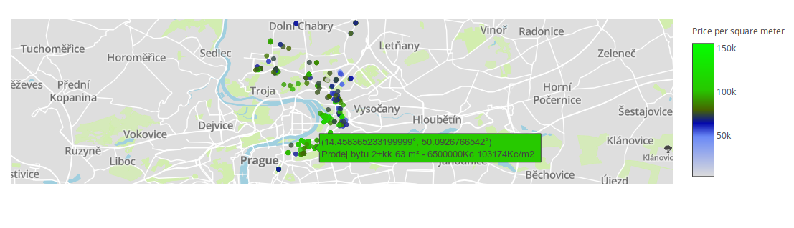

Real Estates in Czech Republic
==============================

Search script for estates in Czech Republic. Filters adverts into the terminal.

Requirements
------------

Install plotly and pandas:

`sudo pip install plotly pandas`

Installation
------------

`mkdir "$HOME/bin"`
`curl -kv https://raw.githubusercontent.com/gnachman/iTerm2/master/tests/imgcat -o "$HOME/bin/imgcat"`
`curl -kv https://raw.githubusercontent.com/gnachman/iTerm2/master/tests/imgls -o "$HOME/bin/imgls"`
`chmod +x "$HOME/bin/imgcat"`
`chmod +x "$HOME/bin/imgls"`

`# Also add this to your $HOME/.profile`
`export PATH="$PATH:$HOME/bin"`

Environment Variables
---------------------
`
export ESTATES_IMAGE=NONE # Do not display images in terminal
`

Execution
---------

Run `./estates.py`

Sample generated price map for Prague 8:

Notes
-----

iTerm2, v3+ needed on OSX which uses imgcat to display images inside terminal. Under Linux, use fim to display images in terminal console using framebuffer:

